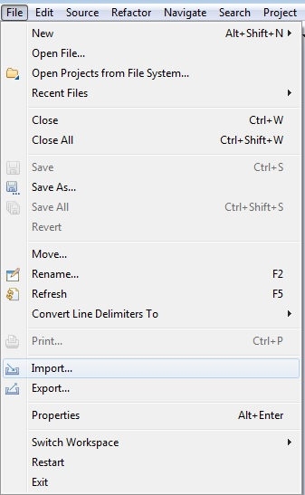
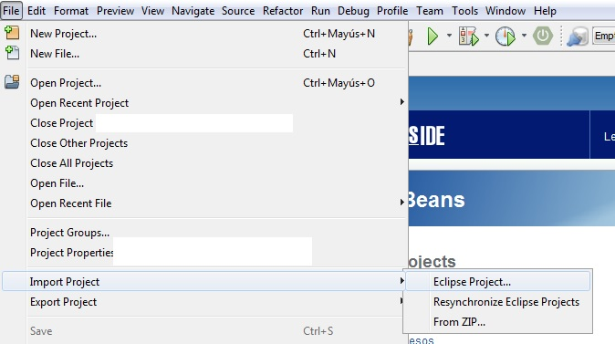
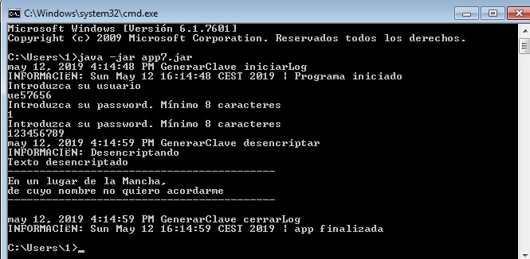
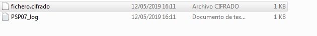
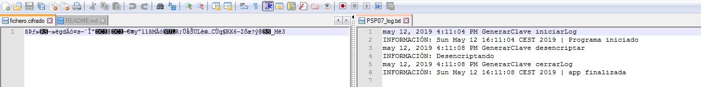

# Encriptado de ficheros
Encriptado y desencriptado de un fichero mediante clave

## Instalación 
Importar proyecto en IDE de Java

Eclipse:  

Netbeans:  

## Ejemplo de uso   
Ejecutar el programa como aplicación de java, en eclipse o consola  por el fichero .jar e introducir los datos que se solicitan:   
  
Comprobar que se han creado los ficheros  
   
Comprobar el contenido de los ficheros creados
  

## Configuración de desarrollo
Requiere instalación de Java 8, y de un navegador web. 

## META
ue57656@edu.xunta.es
Distributed under the CreativeCommons by-nc license. See https://creativecommons.org/licenses/by-nc/2.0/es/  for more information.
